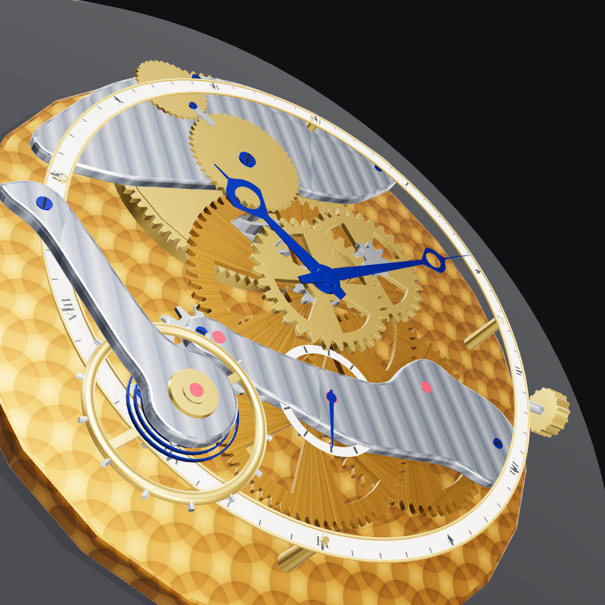

# Mechanical Watch Movement — Three.js

A mechanically coherent Swiss lever watch movement rendered in Three.js.
Every wheel turns at the physically correct rate: the gear ratios are real,
so the hands tell actual time, driven backwards from the escapement.



## The gear train (18,000 bph)

| Mesh | Teeth | Ratio | Result |
|---|---|---|---|
| Barrel → center pinion | 84 : 12 | 7:1 | barrel turns once per 7 h |
| Center wheel → third pinion | 64 : 8 | 8:1 | center = 1 rev/hour (minute hand) |
| Third wheel → fourth pinion | 60 : 8 | 7.5:1 | fourth = 1 rev/min (seconds hand) |
| Fourth wheel → escape pinion | 70 : 7 | 10:1 | escape wheel = 1 rev / 6 s |
| Escape wheel | 15 teeth × 2 beats | — | 30 beats/rev → **18,000 bph**, 2.5 Hz balance |
| Cannon → minute wheel → hour wheel | 10:30 × 8:32 | 12:1 | motion works |

The escape wheel advances in discrete 12° steps, once per beat, gated by the
pallet fork, which is in turn released by the balance wheel's zero crossing
(sinusoidal, 240° amplitude). The whole train — including the stepped,
5-ticks-per-second seconds hand — is derived from that stepping. Tooth phases
of meshing wheels are aligned analytically so teeth interleave at every mesh
point. Gears use true involute profiles.

`test/kinematics.test.mjs` proves the ratios (1 rev/min fourth wheel,
1 rev/h center, 12:1 motion works, 18,000 bph, hand agreement at sample
times): `npm test`.

## Run it

```sh
npm install
npm run serve     # then open http://127.0.0.1:8173/
```

Mouse-orbit/zoom (OrbitControls), `v` cycles the nine camera presets
(overview, topdown, escapement, balance, train, barrel, motion, side, hands),
`h` toggles the HUD showing the simulated watch time. URL params:
`?t=<seconds since 12:00>` sets the time (defaults to your clock),
`?view=<preset>` picks the start view.

## Video render

```sh
node tools/video.js --out watch.mp4 --fps 30 --size 1080
```

Renders a 29 s choreographed showcase (overview orbit, escapement ticking
close-up, balance & hairspring, pull-back over the hands) with the movement
running in real time, then encodes it with ffmpeg.

## Headless captures

```sh
node tools/capture.js --label shot-001                      # all presets
node tools/capture.js --label x --views escapement --hide 1 # hide bridges
node tools/capture.js --label x --seq escapement:36570:0.05:8   # frame seq
node tools/capture.js --label x --custom "name:tx:ty:tz:az:el:dist"
```

Screenshots land in `./iterations/` — that directory holds the full
development time-lapse, one set per iteration.

## Layout

ETA-6498-style: barrel at 1–2 o'clock, center wheel in the middle, small
seconds at 6, escapement and balance (with free-sprung-look blued hairspring,
Geneva-striped rhodium bridges, ruby jewels in gold chatons, perlage main
plate) at 7–9 o'clock.
